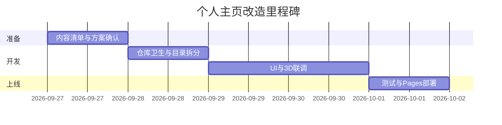

# pubeth.github.io 个人主页改造 — 执行计划

> 文档版本：v1.0  
> 日期：2026-09-27  
> 范围：将当前 GitHub Pages 根目录 `index.html`（Three.js + STL 全屏展示）改造为可用的个人主页，并保留现有 3D 视觉作为品牌特色（可选）。

---

## 1. 现状盘点

| 项目 | 说明 |
|------|------|
| 站点类型 | GitHub User Pages（仓库名 `pubeth.github.io` → 根路径即首页） |
| 当前首页 | 单文件 `index.html`，标题为 “STL loader” |
| 技术栈 | Three.js 0.146（unpkg CDN）、STLLoader、OrbitControls |
| 视觉 | 立方体贴图环境背景 + 透明物理材质吉他模型 `model/guitar.stl`，相机自动绕圈 |
| 资源引用 | 贴图与 STL 使用绝对 URL `https://pubeth.github.io/model/...` |
| 本地仓库 | 根目录除 `index.html`、`.vscode` 外，含 `three.js-master/`（参考用，**不应**作为 Pages 发布内容） |
| 缺失项 | 无个人文案、导航、SEO、联系方式、项目列表；无独立 CSS/资源目录规范 |

**结论：** 当前页是「3D 演示页」，不是「个人主页」。改造核心是：**在保留 3D 特色的前提下，增加信息架构、可读 UI 与可维护的文件结构。**

---

## 2. 改造目标

### 2.1 必须达成（MVP）

1. 访问 `https://pubeth.github.io/` 时，用户能在 **3 秒内** 看懂：你是谁、做什么、如何联系。
2. 页面在 **桌面 + 手机** 上可读、可点击（导航、链接、对比度）。
3. 具备基础 **SEO**（`<title>`、`description`、Open Graph 可选）。
4. 代码结构清晰：`index.html` + `assets/`（或 `css/`、`js/`），便于后续增删区块。
5. GitHub Pages 部署方式不变（静态文件 push 即可）。

### 2.2 建议达成（v1.1）

- 3D 场景作为 **背景/侧边 Hero**，不遮挡正文（半透明遮罩 + 可关闭动画以省性能）。
- 项目卡片链到 GitHub 仓库或 Demo。
- 中英文切换或至少中文为主（按你的受众定）。
- `README.md` 简短说明仓库用途与本地预览方式。

### 2.3 明确不做（除非后续单独立项）

- 后端、数据库、评论系统。
- 把整个 `three.js-master/` 发布到 Pages（体积过大且无必要）。
- 复杂构建链（Webpack/Vite）— 首版优先 **零构建** 静态站；若后期需要再引入。

---

## 3. 信息架构（页面区块）

建议单页滚动（锚点导航），结构如下：

```
┌─────────────────────────────────────────┐
│  Header：Logo/昵称 · 导航 · GitHub 图标   │
├─────────────────────────────────────────┤
│  Hero：一句话定位 + 主 CTA（联系/项目）   │
│        [可选：右侧或背景 3D 吉他场景]      │
├─────────────────────────────────────────┤
│  About：简介、方向（Web/3D/区块链等）     │
├─────────────────────────────────────────┤
│  Skills：标签或分组技能树                 │
├─────────────────────────────────────────┤
│  Projects：3~6 个代表项目（图+链）        │
├─────────────────────────────────────────┤
│  Contact：邮箱 / GitHub / 其他社交        │
├─────────────────────────────────────────┤
│  Footer：版权、备案（如有）、最后更新      │
└─────────────────────────────────────────┘
```

**需要你提供的内容清单（实施前填写）：**

- [ ] 显示名称、英文/中文昵称
- [ ] 一句话 Slogan（例：「全栈开发 · 3D 可视化爱好者」）
- [ ] 200 字以内个人简介
- [ ] 技能列表（10 个以内标签即可）
- [ ] 3~6 个项目：名称、一句话描述、链接、可选封面图
- [ ] 联系方式（邮箱是否公开、GitHub 用户名确认是否为 `pubeth`）
- [ ] 头像（可选，无则用 GitHub 头像 URL）
- [ ] 配色偏好（沿用当前青绿 `#b2ffc8` 科技风 / 深色 / 浅色）

---

## 4. 设计方案（推荐）

### 4.1 布局：「3D 背景 + 前景卡片」（推荐）

- **底层：** 现有 Three.js 场景全屏，`z-index: 0`，`pointer-events: none`（避免抢滚动/点击）。
- **中层：** 深色渐变遮罩（`rgba(0,0,0,0.45~0.65)`），保证文字对比度。
- **顶层：** 居中或左对齐内容区，`max-width: 720~960px`，毛玻璃卡片（`backdrop-filter`）可选。
- **性能：** `prefers-reduced-motion` 时停止相机动画；移动端可选 **默认静态封面图** 代替实时 WebGL。

### 4.2 备选方案

| 方案 | 优点 | 缺点 |
|------|------|------|
| A. 3D 全屏 + 浮层 UI（推荐） | 保留现有特色 | 低端机需降级策略 |
| B. 左文右 3D 分栏 | 阅读体验最好 | 窄屏要折叠，实现稍多 |
| C. 纯静态个人页，3D 链到 `/demo/` | 最轻、SEO 最好 | 首页失去 3D 冲击力 |

**决策点：** 请选定 A / B / C（默认按 **方案 A** 实施）。

### 4.3 视觉规范（初稿）

- 字体：系统栈 `system-ui, "Segoe UI", sans-serif`；中文可加 `"PingFang SC", "Microsoft YaHei"`。
- 主色：沿用场景青绿 `#b2ffc8` 作强调色；背景深灰 `#0f1419`。
- 圆角：卡片 `12px`；按钮 `8px`。
- 动效：仅 hover、锚点平滑滚动，时长 ≤ 200ms。

---

## 5. 技术实施步骤

### 阶段 0：仓库与发布卫生（0.5 天）

1. 确认 Git 远程与 Pages 分支（通常 `main` / `master` 根目录）。
2. 添加 `.gitignore`：忽略 `three.js-master/`、本地大文件、`.vscode`（可选）。
3. 确认 `model/` 资源在仓库或 CDN 中可访问；将 `index.html` 内绝对 URL 改为 **相对路径** `./model/...`（便于本地预览与迁移）。
4. 若 `model/` 未入库：列出需上传文件清单（6 张 cubemap + `guitar.stl`）。

### 阶段 1：文件拆分（0.5 天）

建议目录：

```
pubeth.github.io/
├── index.html          # 语义化结构 + 各 section
├── assets/
│   ├── css/
│   │   └── main.css
│   ├── js/
│   │   ├── scene.js    # Three.js 初始化（从 index 抽出）
│   │   └── site.js     # 导航、平滑滚动、降级逻辑
│   └── img/            # 头像、项目封面、移动端静态后备图
├── model/              # STL + cubemap（与现网一致）
└── docs/
    └── 个人主页改造执行计划.md
```

- `scene.js`：保留现有加载逻辑，增加「仅作背景」模式（禁用 OrbitControls 或限制交互）。
- `site.js`：移动端检测、减少 motion、懒加载 3D（进入视口再 init 可选）。

### 阶段 2：HTML 与样式（1 天）

1. 重写 `index.html`：`<header>`、`<main>` 各 section、`<footer>`。
2. 实现响应式导航（汉堡菜单 ≤ 768px）。
3. 无障碍：`lang="zh-CN"`、跳过链接、焦点样式、图片 `alt`。
4. Meta：`title`、`description`、`theme-color`；可选 OG 标签。

### 阶段 3：内容与项目区（0.5 天，依赖你提供素材）

1. 项目数据可先写死在 HTML，或用 **单文件 JSON** `assets/data/projects.json` 便于维护。
2. GitHub 项目可用 API 可选增强（需处理速率限制；MVP 用手动列表更稳）。

### 阶段 4：性能与兼容（0.5 天）

1. Three.js 继续 CDN 或改为固定版本 + `defer`。
2. 首屏：先渲染文字/CSS，3D `requestIdleCallback` 或延迟 300ms 初始化。
3. 测试：Chrome / Edge / Safari iOS；无 WebGL 时显示静态背景图。
4. Lighthouse 目标：Performance ≥ 80（有 WebGL 时酌情放宽）。

### 阶段 5：部署与验收（0.5 天）

1. 本地用静态服务器预览（如 `npx serve .` 或 VS Code Live Server）。
2. Push 到 GitHub，等待 Pages 构建（1~3 分钟）。
3. 验收清单见第 7 节。

**预估总工时：** 约 2~3 个工作日（含一轮内容校对）；若内容齐备可压缩到 1 天。

---

## 6. 与 GitHub 生态的衔接

| 能力 | 做法 |
|------|------|
| 个人介绍同步 | 可选：仓库根 `README.md` 与首页 About 文案一致 |
| Profile README | `github.com/pubeth` 的特殊 README 与主页分工：Profile 简短，Pages 完整 |
| 自定义域名 | 若有域名：仓库 Settings → Pages → Custom domain + `CNAME` |
| 分析 | 可选 Cloudflare / Google Analytics（隐私政策需说明） |

---

## 7. 验收标准（Checklist）

- [ ] 首页标题与描述符合个人品牌，不再是 “STL loader”
- [ ] 手机竖屏：导航可用，文字不溢出，按钮可点
- [ ] 3D 不阻塞滚动；`prefers-reduced-motion` 下无绕圈动画
- [ ] 所有外链 `rel="noopener noreferrer"`
- [ ] 相对路径在本地与 Pages 均正常加载 model
- [ ] 无控制台报错（STL/贴图 404 为零）
- [ ] （可选）GitHub Pages 构建成功，无意外发布 `three.js-master` 整库

---

## 8. 风险与对策

| 风险 | 对策 |
|------|------|
| 移动端 WebGL 发热/卡顿 | 默认静态图；或降低像素比 `setPixelRatio(Math.min(2, dpr))` |
| model 文件过大 | STL 压缩/简化；或换 glTF + Draco |
| CDN 不可用 | 锁定 three 版本，必要时 vendoring 到 `assets/vendor/` |
| 中英文内容混排 | 统一 `lang` 与文案语言；二期再做 i18n |
| 仓库含 three.js-master 误发布 | `.gitignore` 或移至仓库外；Pages 只 push 站点文件 |

---

## 9. 实施顺序总览（里程碑）



---

## 10. 下一步（需你确认后开工）

1. **选定布局方案：** A（3D 背景 + 浮层）/ B（分栏）/ C（静态首页 + 独立 demo 页）。  
2. **填写第 3 节内容清单**（可直接在 Issue 或聊天里发文字）。  
3. **确认 3D 是否保留在首页**（是 → 方案 A/B；否 → 方案 C，`index.html` 改为纯个人页，`demo.html` 保留现效果）。  
4. 确认后按 **阶段 0 → 5** 实施；每阶段结束可给你预览说明与 diff 摘要。

---

## 附录 A：当前 `index.html` 关键依赖（改造时迁移）

- Three.js：`https://unpkg.com/three@0.146.0/...`
- 模型：`model/guitar.stl`（现网路径 `/model/guitar.stl`）
- 环境贴图：`model/px.png` … `model/nz.png`（6 面）
- 行为：自动轨道相机、`MeshPhysicalMaterial` 玻璃感材质

## 附录 B：可选后续迭代

- 博客：链接到 GitHub Discussions / 独立 Hexo / 子路径 `/blog`
- 深色/浅色主题切换
- 将 STL 演示迁到 `/lab/guitar.html` 并增加更多 3D 作品入口
- CI：GitHub Action 仅部署 `site/` 子目录（若单仓多用途）

---

*本文档随项目迭代更新；实施完成后在文末追加「变更记录」一节。*
